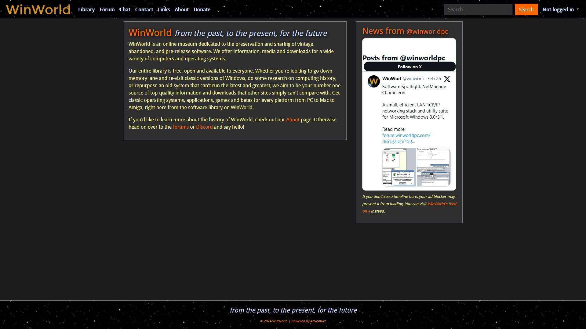

# WinWorld Classic
Recreates the look and feel of WinWorld immediately prior to the switch to Bootstrap in September 2017.

*Majestically powered since August 29th, 2020.*

## Install
This style is available on [UserStyles.world](https://userstyles.world/style/512/winworld-classic).

Installing from GitHub (via `winworldpc.user.css`) is also possible, but not recommended.

### Options
This style has several options to customize the look and feel of the website. These bring the overall experience closer to that of the old site, but may be undesirable to some users.

* **Use classic font** `oldfont` *(enabled by default)*
    * Replace the sitewide font with Droid Sans
    * Added in [`v13`](#january-1st-2024-v13)
* **Fullwidth mode** `nomargin`
    * Disable left and right body margins, allowing content to fill the entire width of the display
    * Added in [`v15`](#july-28th-2024-v15)
* **Disable CSS transitions** `notransition`
    * Disable smooth fade effect when interacting with inputs and buttons
    * Added in [`v16`](#august-1st-2024-v16)

## Changelogs
#### August 1st, 2024 `v16`
* Added an option to disable fade transitions when interacting with inputs and buttons
* Subheaders are now light blue
* Download counts in search results are now properly coloured
* Orange glow on text inputs now also applies to product comments
* Reimplemented blockquote visibility improvements for product comments

#### July 28th, 2024 `v15`
* Complete rewrite; the new code is over 300 lines shorter
    * Tab width reduced from 4 to 2 spaces
    * Code sections are now labelled by purpose
    * The code is now much more modular and easily modifiable
* Added a fullwidth mode, wherein the page content fills the entire width of the display
* Text inputs are now more historically accurate and easier to distinguish
    * Light blue text on a black background
    * Orange glow when selected
    * Should no longer turn white when selected
* Visibility of various platform logos (PPC, VAX, Z80, Other) improved

#### July 17th, 2024 `v14`
* Some minor code cleanup
* Overhaul button code (this should fix some bugs and improve consistency)
* Fix `<select>` element styling in Advanced Search
* Remove code for green text on homepage (was broken and unnecessary)

#### January 1st, 2024 `v13.1`
* Fix `::before` and `::after` formatting

#### January 1st, 2024 `v13`
* Use data URLs for images
* Image URLs are now stored as variables at the bottom of the file
* Droid Sans font can now be disabled in options

#### June 20th, 2023 `v12.1`
* Reorganized files on GitHub
* Updated style to point to new file locations

#### May 7th, 2023 `v12`
* Added slogan to footer
* Removed "Majestically Powered" text from About page
* Removed WOFF and OpenType fonts in favour of WOFF2
* Move to GitHub for hosting

#### February 25th, 2023 `v11`
* Fixed "no search results" text appearing as dark grey
* Inverted signup captcha for better visibility

#### December 22nd, 2021 `v10`
* Fixed a few instances where buttons would revert to their original colours when clicked
* Updated Donate page for consistency with product pages

#### September 20th, 2021 `v9`
* Removed some unused code for the sitewide font
* Simplified colours to use 3-digit hex codes where possible

#### August 1st, 2021 `v8`
* Modified bold font for accuracy to the original website
* Fixed About page easter egg

#### April 16th, 2021 `v7`
* Added dark scrollbars

#### February 27th, 2021 `v6`
* Changed sitewide font to Droid Sans
* Fixed card headers on Donate page
* The first revision of this update introduced a bug that broke the appearance of the forums; this has since been corrected

#### January 24th, 2021 `v5`
* Fixed category badges on search pages so they don't revert to their original colour when hovered over

#### December 22nd, 2020 `v4`
* Changed the PPC icon from black to white for better visibility on dark backgrounds

#### November 27th, 2020 `v3`
* Switched to ImgBB for image hosting, as Imgur does not allow hotlinking

#### September 11th, 2020 `v2`
* Made comment attachments dark to match the rest of the site
* Fixed the "This discussion has been closed" message on pages with comments disabled
* Added a little bonus to the About page for a bit of added nostalgia

#### August 29th, 2020 `v1`
The initial release of this style brings back the overall look of WinWorld from 2017 and earlier. This includes details such as:
* Dark elements, including buttons, input boxes, and alerts
* A heavy focus on orange and yellow accent colours
* Old WinWorld logo
* Starry header and footer graphics
* Category badges coloured and arranged just like the old site
* Product comment sections styled to match the rest of the site
* A classic look for pages that didn't exist on the old site
* Lots of other small details and adjustments to make the experience more authentic

